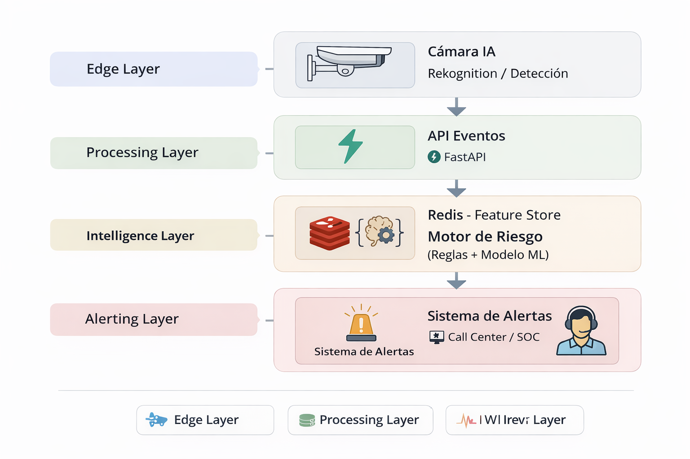

# Behavioral Risk Engine for Smart Surveillance

## Overview
Enterprise-ready behavioral intelligence layer designed to enhance AI-enabled surveillance cameras. 
The system consumes detection metadata (e.g., Rekognition or vendor AI), builds temporal behavioral features, 
and generates contextual risk scores using rules and anomaly detection models.

## Problem
Traditional AI cameras detect objects but do not understand behavioral patterns over time.
This project introduces contextual behavioral analytics to detect suspicious pre-crime patterns.

## Architecture
Camera → AI Detection (e.g., Rekognition) → Event Processor → Feature Store (Redis) → Risk Engine → Alert System

## Features
- Monthly Watchlist ingestion (CSV)
- Temporal feature engineering (5m / 1h / 24h windows)
- Risk scoring (Rules + Isolation Forest)
- Redis-based real-time feature store
- FastAPI REST interface

## Tech Stack
- Python
- FastAPI
- Redis
- Scikit-learn
- Docker

## Run Locally
1. docker compose up -d
2. pip install -r requirements.txt
3. python training/train_model.py
4. uvicorn app.main:app --reload

## Sample Risk Output
{
  "risk_score": 85,
  "alert_level": "HIGH",
  "reasons": ["watchlist_match", "vehicle_many_visits_24h"]
}

## Future Improvements
- Replace IsolationForest with XGBoost using labeled SOC feedback
- Add drift detection
- Add ALPR integration
- Add explainability layer (SHAP)

## Arquitectura

